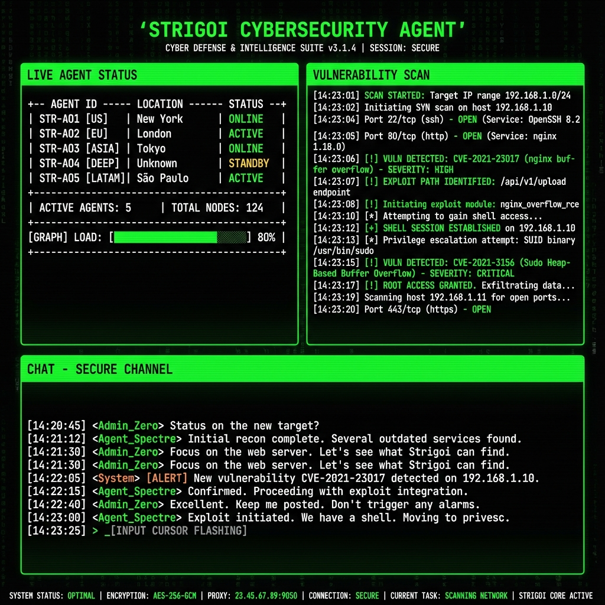

<p align="center">
  <a href="https://github.com/Kelbresqe/strigoi">
    
  </a>
</p>

<h1 align="center">Strigoi</h1>

<h2 align="center">Open-source AI Security Agents that Hunt Vulnerabilities</h2>

<div align="center">

[](https://www.python.org/)
[](LICENSE)
[](https://github.com/Kelbresqe/strigoi)

</div>

<br>

<div align="center">
  
</div>

<br>

> [!TIP]
> **New!** Strigoi integrates seamlessly with GitHub Actions and CI/CD pipelines. Automatically scan for vulnerabilities on every pull request and block insecure code before it reaches production!

---

## 🦉 Strigoi Overview

Strigoi are autonomous AI agents that hunt vulnerabilities like a predator in the night. They act just like elite hackers - running your code dynamically, identifying weaknesses, and validating them through actual proof-of-concepts. Built for developers and security teams who need fast, lethal accuracy in security testing without the overhead of manual pentesting or the false positives of static analysis tools.

**Key Capabilities:**

- 🔧 **Full Hunter's Toolkit** out of the box
- 🤝 **Coven of Agents** that collaborate and scale
- ✅ **Real Validation** with PoCs, not false positives
- 💻 **Developer‑first** CLI with actionable reports
- 🔄 **Auto‑fix & Reporting** to accelerate remediation


## 🎯 Use Cases

- **Application Security Testing** - Detect and validate critical vulnerabilities in your applications
- **Rapid Penetration Testing** - Get penetration tests done in hours, not weeks, with compliance reports
- **Bug Bounty Automation** - Automate bug bounty research and generate PoCs for faster reporting
- **CI/CD Integration** - Run tests in CI/CD to block vulnerabilities before reaching production

---

## 🚀 Quick Start

**Prerequisites:**
- Docker (running)
- Python 3.12+
- An LLM provider key (e.g. [get OpenAI API key](https://platform.openai.com/api-keys) or use a local LLM)

### Installation & First Scan

```bash
# Install Strigoi
pipx install strigoi

# Configure your AI provider
export STRIGOI_LLM="openai/gpt-5"
export LLM_API_KEY="your-api-key"

# Run your first security assessment
strigoi --target ./app-directory
```

> [!NOTE]
> First run automatically pulls the sandbox Docker image. Results are saved to `strigoi_runs/<run-name>`

---

## ✨ Features

### 🛠️ Agentic Security Tools

Strigoi agents come equipped with a comprehensive security testing toolkit:

- **Full HTTP Proxy** - Full request/response manipulation and analysis
- **Browser Automation** - Multi-tab browser for testing of XSS, CSRF, auth flows
- **Terminal Environments** - Interactive shells for command execution and testing
- **Python Runtime** - Custom exploit development and validation
- **Reconnaissance** - Automated OSINT and attack surface mapping
- **Code Analysis** - Static and dynamic analysis capabilities
- **Grimoire** - Structured findings and attack documentation

### 🎯 Comprehensive Vulnerability Detection

Strigoi can identify and validate a wide range of security vulnerabilities:

- **Access Control** - IDOR, privilege escalation, auth bypass
- **Injection Attacks** - SQL, NoSQL, command injection
- **Server-Side** - SSRF, XXE, deserialization flaws
- **Client-Side** - XSS, prototype pollution, DOM vulnerabilities
- **Business Logic** - Race conditions, workflow manipulation
- **Authentication** - JWT vulnerabilities, session management
- **Infrastructure** - Misconfigurations, exposed services

### 🕸️ Coven of Agents

Advanced multi-agent orchestration for comprehensive security testing:

- **Distributed Workflows** - Specialized agents for different attacks and assets
- **Scalable Testing** - Parallel execution for fast comprehensive coverage
- **Dynamic Coordination** - Agents collaborate and share discoveries

---

## 💻 Usage Examples

### Basic Usage

```bash
# Scan a local codebase
strigoi --target ./app-directory

# Security review of a GitHub repository
strigoi --target https://github.com/org/repo

# Black-box web application assessment
strigoi --target https://your-app.com
```

### Advanced Testing Scenarios

```bash
# Grey-box authenticated testing
strigoi --target https://your-app.com --instruction "Perform authenticated testing using credentials: user:pass"

# Multi-target testing (source code + deployed app)
strigoi -t https://github.com/org/app -t https://your-app.com

# Focused testing with custom instructions
strigoi --target api.your-app.com --instruction "Focus on business logic flaws and IDOR vulnerabilities"
```

### 🤖 Headless Mode

Run Strigoi programmatically without interactive UI using the `-n/--non-interactive` flag—perfect for servers and automated jobs. The CLI prints real-time vulnerability findings, and the final report before exiting. Exits with non-zero code when vulnerabilities are found.

```bash
strigoi -n --target https://your-app.com
```

### 🔄 CI/CD (GitHub Actions)

Strigoi can be added to your pipeline to run a security test on pull requests with a lightweight GitHub Actions workflow:

```yaml
name: strigoi-penetration-test

on:
  pull_request:

jobs:
  security-scan:
    runs-on: ubuntu-latest
    steps:
      - uses: actions/checkout@v4

      - name: Install Strigoi
        run: pipx install strigoi

      - name: Run Strigoi
        env:
          STRIGOI_LLM: ${{ secrets.STRIGOI_LLM }}
          LLM_API_KEY: ${{ secrets.LLM_API_KEY }}

        run: strigoi -n -t ./
```

### ⚙️ Configuration

```bash
export STRIGOI_LLM="openai/gpt-5"
export LLM_API_KEY="your-api-key"

# Optional
export LLM_API_BASE="your-api-base-url"  # if using a local model, e.g. Ollama, LMStudio
export PERPLEXITY_API_KEY="your-api-key"  # for search capabilities
```

[OpenAI's GPT-5](https://openai.com/api/) (`openai/gpt-5`) and [Anthropic's Claude Sonnet 4.5](https://claude.com/platform/api) (`anthropic/claude-sonnet-4-5`) are the recommended models for best results with Strigoi. We also support many [other options](https://docs.litellm.ai/docs/providers), including cloud and local models, though their performance and reliability may vary.

## 🤝 Contributing

We welcome contributions from the community! There are several ways to contribute:

### Code Contributions
See our [Contributing Guide](CONTRIBUTING.md) for details on:
- Setting up your development environment
- Running tests and quality checks
- Submitting pull requests
- Code style guidelines


### Prompt Modules Collection
Help expand our collection of specialized prompt modules for AI agents:
- Advanced testing techniques for vulnerabilities, frameworks, and technologies
- See [Prompt Modules Documentation](strigoi/prompts/README.md) for guidelines
- Submit via [pull requests](https://github.com/Kelbresqe/strigoi/pulls) or [issues](https://github.com/Kelbresqe/strigoi/issues)

## 🌟 Support the Project

**Love Strigoi?** Give us a ⭐ on GitHub!

> [!WARNING]
> Only test apps you own or have permission to test. You are responsible for using Strigoi ethically and legally.

## 🔒 Security Implications

Strigoi is a powerful penetration testing tool that requires privileged access to function correctly. Specifically, the Docker containers used for sandboxing require `NET_ADMIN` and `NET_RAW` capabilities to perform network scanning and packet manipulation.

**Recommendation:**
- **Do not run Strigoi on your personal workstation or a production server.**
- Use a dedicated Virtual Machine (VM) or a Virtual Private Server (VPS) for running scans.
- Ensure the environment is isolated from your internal network unless you explicitly intend to scan it.

</div>
```
